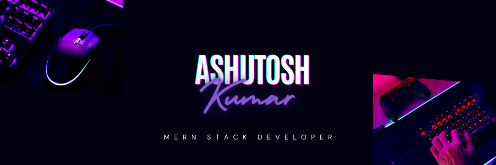
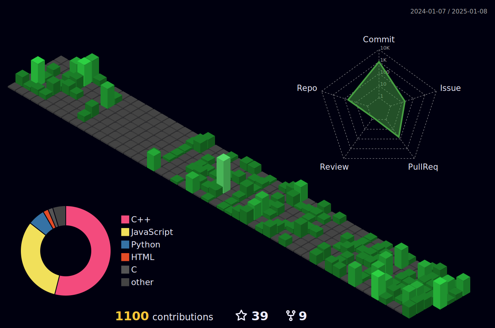

<h1 align="center">Hi 👋, I'm Ashutosh Kumar</h1>
<h3 align="center">A passionate full-stack developer from India</h3>

 

  

- 🔭 I’m currently working on **agents**

- 🌱 I’m currently learning **rag integration,multi modal input,system design,ai agents**

- 👨‍💻 All of my projects are available at [My Portfolio](https://portfolio-five-rho-46.vercel.app/) (Many are private)

- 💬 Ask me about **react, mongodb, express, node, tailwind css, redis, docker, rag, agents**

- 📫 How to reach me **ak956901@gmail.com**
  
- 📄 Know about my experiences [My Resume](https://www.dropbox.com/scl/fi/e0zymreo6u9sri8ajy48k/My_resume-1.pdf?rlkey=8kc7n028losghqwr6e3if5q2o&st=68t75cbe&dl=0)

- ⚡ Fun fact **A React component walks into a bar. The bartender says, "Hey, we have a two-drink minimum here. Are you sure you can handle it?" The React component replies, "Don't worry, I've got my props!"**

 
 

  

  

<h3 align="left">Connect with me:</h3>

<h3 align="left">Languages and Tools:</h3>

### My Gists

&nbsp;

